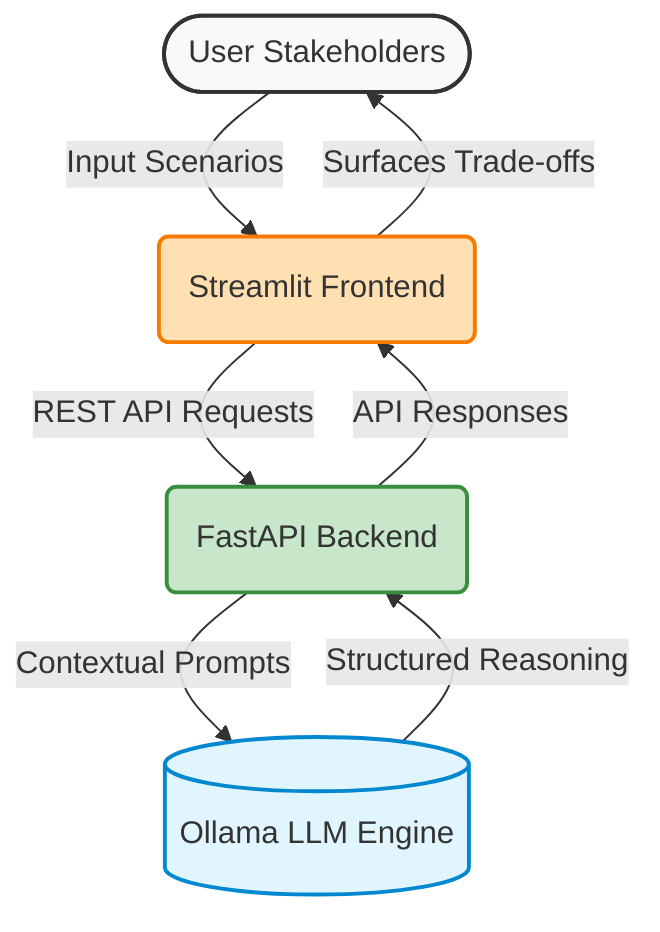

# Presentation Outline: Why a Vendor Decision Intelligence Application Exists

Based on the project's core documentation, here is a presentation outline structured slide-by-slide. This deck is focused on the strategic "why" of the application, intended for an audience of senior leaders, procurement heads, and supply-chain experts.

---

## Slide 1: Title & Purpose
- **Title:** Why a Vendor Decision Intelligence Application Exists
- **Audience Context:** Senior leaders, procurement heads, engineering, and supply-chain experts.
- **Purpose:** To set the context for the demo — focusing on *why* this application is needed, rather than the technical *how*.

---

## Slide 2: A Familiar Situation
- **Scenario:** A sourcing decision is being finalized for a critical component. Quotes are in, timelines are tight, and all shortlisted vendors are technically qualified.
- **The Inevitable Question:** “Why are we comfortable with this option?”
- **The Typical Answers:** 
  - “It was the best balance overall.”
  - “The differences weren’t material.”
- **Key Insight:** These aren't weak answers; they are purely human answers under the weight of complexity.

---

## Slide 3: The Real Challenge
- **Observation:** Organizations rarely struggle with the act of deciding.
- **The True Struggles:** 
  - Reconstructing *why* a particular decision was made later on.
  - Aligning different stakeholders on the necessary trade-offs.
  - Surfacing hidden assumptions before they harden into facts.
  - Preparing for negotiations without hindsight bias.
- **Takeaway:** The real friction lies between disjointed information and human judgment.

---

## Slide 4: Where Complexity Erodes Decision Quality
- **Evidence Fragments:** Facts are scattered across spreadsheets, PDFs, emails, and memories. Experts waste time reconstructing context instead of reasoning.
- **Assumptions Remain Implicit:** Risk tolerance and stability are assumed rather than explicitly stated, only surfacing when challenged.
- **Trade-offs Appear Late:** Conversations about compromises happen during negotiations or audits, rather than beforehand.
- **Key Insight:** This erodes decision quality not due to a lack of expertise, but due to immense cognitive load under pressure.

---

## Slide 5: A Concrete Case Study
- **Scenario:** Sourcing a control unit for an automotive program.
  - *Vendor A:* Lowest price, longest lead time.
  - *Vendor B:* Moderate price and lead time.
  - *Vendor C:* Highest price, shortest lead time.
- **The Hidden Elements (Rarely Written Down):**
  - Which specific trade-off mattered most?
  - Which risks were consciously accepted?
  - What assumed conditions, if broken, would invalidate the decision?
- **Conclusion:** The eventual decision might be right, but the *reasoning* behind it remains incredibly fragile.

---

## Slide 6: Why This Application Exists
- **Timing:** This application steps in *before* financial commitment. 
- **Core Mission:** Not to make the decision, but to clarify it.
- **What it does:**
  - Establishes a shared factual baseline.
  - Makes hidden assumptions visible early.
  - Articulates trade-offs before negotiations even begin.
- **What it does NOT do:** It does not recommend vendors, rank options, or replace human judgment.

---

## Slide 7: What Changes? (Before vs. After)
- **Before the App:**
  - Experts reconcile inputs manually.
  - Assumptions live exclusively in people’s heads.
  - Trade-offs consistently surface late.
- **With the App:**
  - Facts are visible, centralized, and traceable.
  - Assumptions are named explicitly and documented.
  - Trade-offs are framed early in the process.
- **Takeaway:** The decision remains human, but the reasoning becomes clear and highly defensible.

---

## Slide 8: Why This Matters Now
- **Scaling Complexity:** As organizations grow, decisions involve more stakeholders, scrutiny increases, and auditability becomes critical.
- **The Shift in Leadership Questions:**
  - *Old Question:* “Was this the cheapest option?”
  - *New Question:* “Did we deeply understand the trade-offs when we made this call?”
- **Value Proposition:** This application prepares the team to answer that new question long before it is even asked.

---

## Slide 9: Closing Thoughts
- **How to Think About It:** This system is not automation and it is not optimization. It is a **structured mirror for expert reasoning under complexity.**
- **Final Takeaway:** The application doesn't change *who* decides. It changes how clearly that decision is framed, how early assumptions surface, and how flawlessly prepared teams are for negotiation and audit. 

---

## Slide 10: System Architecture
- **Interactive Interface (Frontend):** Built with **Streamlit**, functioning as the user-facing platform where stakeholders input scenarios and explore vendor profiles.
- **Core API System (Backend):** Powered by **FastAPI**, acting as the bridge linking the interface to the analytical engine.
- **Decision Engine (LLM):** Utilizing **Ollama** locally, enabling highly contextual analysis of vendor choices without exposing sensitive data externally.

